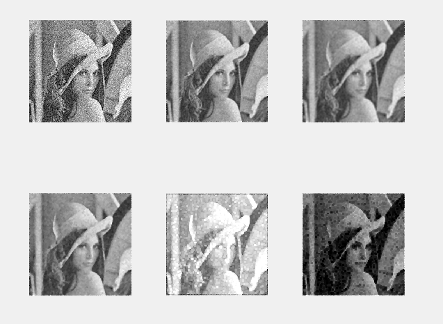

# Digital image processing

This repository contains Gaussian filtering, mean filtering, median filtering, maximum filtering, and minimum filtering methods implemented by matlab.

Run main.m to get started.

